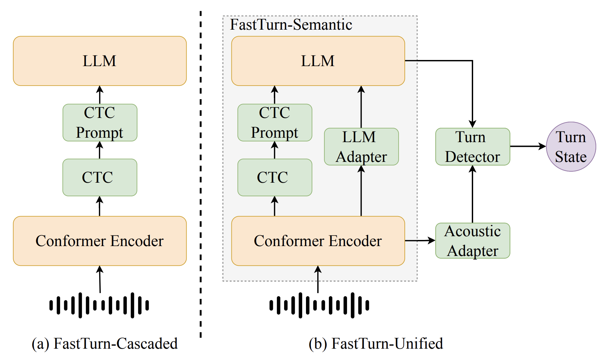
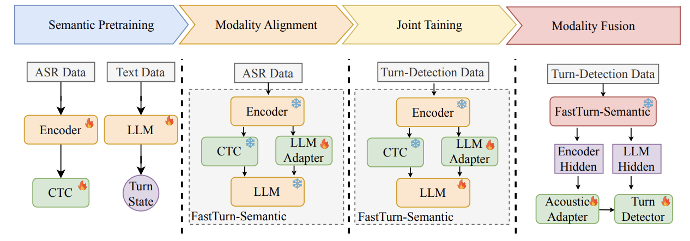

# FastTurn: Low-Latency Turn Detection for Full-Duplex Spoken Dialogue Systems

This repository releases both the **FastTurn model** and the **FastTurn Test Set**.  
The model provides a unified solution for real-time turn detection, while the test set offers a benchmark designed to evaluate turn-taking behavior under realistic conversational conditions.

# Download
comming soon

# FastTurn Framework

FastTurn is a unified framework for low-latency and robust turn detection in full-duplex spoken dialogue systems.  
It integrates streaming CTC decoding, semantic reasoning with large language models (LLMs), and acoustic–semantic fusion to enable accurate real-time turn-taking decisions.

### Architecture

FastTurn consists of three major components:

- FastTurn-Semantic
- Acoustic Adapter
- Turn Detector

  

  

# FastTurn Test Set

Current open-source dialogue corpora often lack detailed turn-taking annotations, which limits the development of reliable turn detection models. To address this issue, we collected high-quality **dual-channel real human-to-human dialogue data** and constructed the **FastTurn Test Set** through precise annotation.

The annotations include rich interaction-level labels such as:

- speaker identities
- emotions
- timestamps
- turn boundaries
- paralinguistic cues, such as pauses, overlaps, and backchannels
- transcriptions

These annotations provide a comprehensive view of interaction structure, temporal alignment, and interruption behavior. By combining dual-channel audio with rich multi-dimensional annotations and transcriptions, the FastTurn Test Set serves as a useful resource for research on dialogue coordination, interruption modeling, and full-duplex spoken dialogue systems.

## Statistics

To evaluate turn-state prediction, we construct an evaluation set consisting of segments from real-world data and 1,000 synthetically generated _wait_ state samples, as shown below. Since the _wait_ state is rare in natural conversations, we supplement the set with synthesized samples generated using DeepSeek V3 for text generation and IndexTTS2 for audio synthesis.

| Turn State  | Source      | Samples | Duration (h) |
|-------------|-------------|--------:|-------------:|
| Complete    | real-world  | 14709   | 9.64         |
| Incomplete  | real-world  | 3643    | 2.15         |
| Backchannel | real-world  | 3080    | 0.42         |
| Wait        | Synthesized | 1000    | 0.71         |

---
